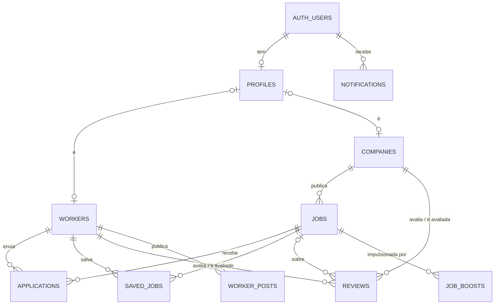

# Supabase — estrutura preparada (ainda sem conexão)

O app **continua 100% em modo mock**: os dados de demonstração vivem em memória (`src/data/seed.ts`) e
login, cadastro e envios são simulados com os mesmos atrasos do legado. Nada chama a rede. Este
documento descreve o que já está pronto para ligar o Supabase depois, onde mexer e em que ordem.

## 1. Como o app decide entre mock e Supabase

`src/services/supabase.ts` lê `VITE_SUPABASE_URL` e `VITE_SUPABASE_ANON_KEY` do ambiente:

| Situação                      | `supabaseConfig()` | `getSupabase()`                      | App                                            |
| ----------------------------- | ------------------ | ------------------------------------ | ---------------------------------------------- |
| Variáveis ausentes (hoje)     | `null`             | resolve `null`                       | modo mock, exatamente como agora               |
| As duas variáveis preenchidas | `{ url, anonKey }` | cria o cliente uma vez e o reutiliza | continua mock até os serviços usarem o cliente |

- O cliente é criado sob demanda com `import('@supabase/supabase-js')`: a biblioteca **não entra no
  bundle** enquanto nenhum serviço chamar `getSupabase()` (hoje nenhum chama — o build atual é byte a
  byte o mesmo de antes desta preparação).
- Criar o cliente não faz requisição; só uma consulta faz.
- Quem usar o cliente trata o caso `null` — é isso que mantém o app funcionando sem projeto.

## 2. O que já está no repositório

| Arquivo                                               | Papel                                                                                                         |
| ----------------------------------------------------- | ------------------------------------------------------------------------------------------------------------- |
| `src/services/supabase.ts`                            | Cliente isolado: `supabaseConfig()`, `isSupabaseConfigured()`, `getSupabase()` (tipado com o esquema abaixo). |
| `src/types/supabase.ts`                               | Tipos das tabelas no formato do `supabase gen types` (`Row`/`Insert`/`Update`/`Relationships`, enums).        |
| `src/services/supabaseMappers.ts`                     | Conversão pura linha ↔ modelo do app (`Job`, `Company`, `Worker`, …) e do snapshot inteiro (`Database`).      |
| `supabase/migrations/20260925000000_bicos_schema.sql` | Esquema sugerido: enums, tabelas, relações, índices, gatilho de `updated_at` e políticas RLS.                 |
| `.env.example` · `src/env.d.ts`                       | Variáveis necessárias (sem valores) e a tipagem de `import.meta.env`.                                         |
| `src/__tests__/supabase.test.ts`                      | Cliente desligado sem variáveis, criação preguiçosa sem requisição, consultas tipadas, ida e volta dos dados. |
| `eslint.config.js` (`no-restricted-imports`)          | Telas, componentes e hooks não podem importar `src/data/`: dado só pela camada `services/`.                   |

Os enums do esquema reaproveitam os tipos do domínio (`Role`, `DiasKey`, `ApplicationStatus`,
`NotificationKind`, `BoostPlanId`, …): se um lado mudar sem o outro, o `npm run typecheck` acusa.

## 3. Variáveis de ambiente

| Variável                 | Onde encontrar                           | Observação                                                                             |
| ------------------------ | ---------------------------------------- | -------------------------------------------------------------------------------------- |
| `VITE_SUPABASE_URL`      | Supabase → Project Settings → API → URL  | Ex.: `https://abcdefgh.supabase.co`.                                                   |
| `VITE_SUPABASE_ANON_KEY` | Supabase → Project Settings → API → anon | Chave **pública**, feita para o navegador; quem protege os dados são as políticas RLS. |

- Localmente: copie `.env.example` para `.env.local` (ignorado pelo git) e preencha.
- Em produção/CI: defina as duas no ambiente **do build** — o Vite embute os valores `VITE_*` no
  JavaScript na hora de compilar.
- **Nunca** use a chave `service_role` no front-end nem a versione: ela ignora o RLS. Ela só serve para
  scripts locais/servidor (ex.: carregar os dados de demonstração, Edge Functions).

## 4. Estrutura de tabelas sugerida



| Tabela          | Chave                                   | Colunas principais (tipo)                                                                                                                                                                                                                                                                            | Relações                             | No app hoje                                            |
| --------------- | --------------------------------------- | ---------------------------------------------------------------------------------------------------------------------------------------------------------------------------------------------------------------------------------------------------------------------------------------------------- | ------------------------------------ | ------------------------------------------------------ |
| `profiles`      | `id uuid` = `auth.users.id`             | `role app_role` ('trabalhador' \| 'recrutador'), `worker_id text?`, `company_id text?`                                                                                                                                                                                                               | → `workers`, → `companies` (1:1)     | `store.role`, `CURRENT_WORKER_ID`/`CURRENT_COMPANY_ID` |
| `companies`     | `id text`                               | `owner_id uuid?`, `name`, `cnpj?` (único), `tipo_obra?`, `location`, `whatsapp`, `rating numeric(2,1)`, `review_count int`, `verified bool`, `verified_since?`, `since_label?`, `respond_time?`, `paid_count int?`, `logo_url?`, `cover_url?`                                                        | → `auth.users`                       | `Company` (sem `reviews`)                              |
| `workers`       | `id text`                               | `user_id uuid?`, `name`, `initials`, `role` (ofício), `region`, `distance`, `rating numeric(2,1)`, `jobs_done int`, `novo bool`, `verified bool`, `specialties text[]`, `facts text[]`, `cpf?` (único), `photo_url?`                                                                                 | → `auth.users`                       | `Worker` (sem `reviews`)                               |
| `jobs`          | `id text` ("BC-…", sequência ≥ 6000)    | `company_id`, `role`, `pay int?` (null = a combinar), `location`, `address`, `distance`, `date_label?`, `hours?`, `duration`, `dias dias_semana?`, `urgent`, `boosted`, `photos text[]?`, `slots int ≥ 1`, `closed`, `sem_contratacao`, `city?`, `description`, `requirements text[]`, `deleted_at?` | → `companies` (N:1)                  | `Job`; `deleted_at` = `deletedJobIds`                  |
| `applications`  | `id text` · único `(job_id, worker_id)` | `job_id`, `worker_id`, `status application_status`, `created_at`, `updated_at` (gatilho)                                                                                                                                                                                                             | → `jobs`, → `workers`                | `Application`                                          |
| `saved_jobs`    | `(worker_id, job_id)`                   | `saved_at`                                                                                                                                                                                                                                                                                           | → `workers`, → `jobs`                | `savedJobIds` (ordem de salvamento)                    |
| `reviews`       | `id bigint` (identidade)                | `direction` ('para_construtora' \| 'para_trabalhador'), `company_id?`, `worker_id?`, `job_id?`, `author_label`, `value smallint 1–5`, `text`, `date_label`                                                                                                                                           | → `companies`, → `workers`, → `jobs` | `Company.reviews` / `Worker.reviews`                   |
| `worker_posts`  | `id text`                               | `worker_id`, `media_url?`, `media_type` ('image' \| 'video'), `caption`, `posted_on date`                                                                                                                                                                                                            | → `workers`                          | `WorkerPost`                                           |
| `notifications` | `id bigint` (identidade)                | `user_id uuid`, `kind notification_kind`, `title`, `body`, `created_at`, `read_at?`                                                                                                                                                                                                                  | → `auth.users`                       | `services/notifications.ts`                            |
| `job_boosts`    | `id bigint` (identidade)                | `job_id`, `plan boost_plan`, `price_cents int`, `ends_at`                                                                                                                                                                                                                                            | → `jobs`                             | só as flags `boosted`/`urgent` da vaga                 |

Convenções (as mesmas de `supabaseMappers.ts`): colunas em snake_case ↔ campos em camelCase; flags que
o mock só liga (`urgent`, `boosted`, `closed`, `sem_contratacao`, `novo`) são `boolean not null default
false` e somem do objeto quando `false`; os demais opcionais são colunas nulas e somem quando `null`.

Observações sobre o modelo:

- Os ids de texto ("meridiano", "jorge", "BC-4821") são os dos dados de demonstração; registros novos
  recebem `gen_random_uuid()` (vagas: `BC-6000`, `BC-6001`, … pela sequência `job_code_seq`).
- `date_label`, `hours`, `distance`, `author_label` e `date_label` das avaliações são **textos de
  exibição**, como no mock ("Hoje", "7h–17h", "3,2 km", "30 jul"). Ao ligar dados reais, vale trocar
  por datas/horários/coordenadas e formatar na tela.
- RLS (seção final do SQL): cada usuário vê a vitrine (vagas, perfis, avaliações) e mexe só no que é
  seu; a construtora decide as candidaturas das suas vagas. É um ponto de partida — revise antes de
  produção.

## 5. Pontos de troca (o que reescrever em `services/`)

As telas **não mudam**: elas só chamam as funções abaixo. Cada linha diz o que a função faz hoje e o
que ela passa a fazer com o Supabase.

| Arquivo · função                                        | Hoje (mock)                                                           | Com Supabase                                                                                                                                               |
| ------------------------------------------------------- | --------------------------------------------------------------------- | ---------------------------------------------------------------------------------------------------------------------------------------------------------- |
| `auth.ts` · `signIn(role)`                              | espera 500 ms e entra no lado escolhido                               | `auth.signInWithPassword` / `signInWithOAuth({ provider: 'google' })` / `signInWithOtp({ phone })`; o lado vem de `profiles.role` → `setRole`              |
| `auth.ts` · `signUp(data)`                              | espera 700 ms; dois CPF/CNPJ fixos dão "já cadastrado"                | `auth.signUp({ email, password })` + insert em `workers`/`companies`; violação de `cpf`/`cnpj` único (erro `23505`) → `{ ok: false, reason: 'doc-taken' }` |
| `auth.ts` · `finishSignUp(role)`                        | entra no app; as respostas do perfil não são guardadas (legado)       | upsert do perfil completo (região, especialidades, tipo de obra) e de `profiles`                                                                           |
| `auth.ts` · `requestPasswordReset` / `resetPassword`    | esperam 600 ms                                                        | `auth.resetPasswordForEmail(email, { redirectTo: '<site>/#/redefinir-senha' })` / `auth.updateUser({ password })`                                          |
| `account.ts` · `exportMyData()`                         | espera 900 ms                                                         | Edge Function que monta o arquivo (LGPD) e manda por e-mail                                                                                                |
| Tela Privacidade · "Excluir minha conta"                | só volta ao login (legado)                                            | criar `account.deleteAccount()` → Edge Function com `auth.admin.deleteUser` (as FKs apagam em cascata)                                                     |
| `marketplace.ts` · `publishJob(draft)`                  | espera 700 ms, gera "BC-…" e grava no store                           | insert em `jobs` (id pela sequência; bairro/distância a partir do endereço) e devolve o id                                                                 |
| `marketplace.ts` · `submitApplication(jobId, workerId)` | espera 600 ms e grava no store                                        | insert em `applications`                                                                                                                                   |
| `store.ts` · estado inicial                             | cópia de `data/seed.ts`                                               | carregar as tabelas e montar o snapshot com `databaseFromRows(rows)`; o store vira o cache do cliente (as telas continuam lendo `useDb()`/`selectors`)     |
| `store.ts` · `cancelApplication`                        | remove a candidatura                                                  | delete em `applications`                                                                                                                                   |
| `store.ts` · `decideApplication`                        | muda o status; ao lotar, recusa os pendentes                          | update em `applications`; a regra de lotação deve ir para o banco (função RPC ou gatilho), para valer para todos                                           |
| `store.ts` · `closeJob`                                 | fecha a vaga (sem contratação se ninguém aprovado) e recusa pendentes | RPC com a mesma regra, em transação                                                                                                                        |
| `store.ts` · `markReviewed`                             | marca "avaliada"; o conteúdo da avaliação não é guardado (legado)     | update em `applications` + insert em `reviews`                                                                                                             |
| `store.ts` · `toggleSavedJob`                           | alterna no array                                                      | insert/delete em `saved_jobs`                                                                                                                              |
| `store.ts` · `deleteJobPost` · `updateJob`              | array de excluídas · patch da vaga                                    | update `jobs.deleted_at` · update em `jobs` (impulsionar: + insert em `job_boosts` após o pagamento)                                                       |
| `store.ts` · `updateCompany` · `updateWorker`           | patch no objeto                                                       | update em `companies` / `workers`                                                                                                                          |
| `store.ts` · `addWorkerPost` · `deleteWorkerPost`       | no início / remove da lista                                           | insert / delete em `worker_posts`                                                                                                                          |
| `store.ts` · `setRole`                                  | troca o lado da demonstração                                          | passa a refletir a sessão (`profiles.role`)                                                                                                                |
| `media.ts` · `mediaUrl(file)`                           | URL `blob:` local, nada é enviado (legado)                            | upload no Storage (bucket `media`) e URL pública. **Fica assíncrono**: `PhotoManager`, `PhotoSlot` e `WorkerPosts` precisam de um estado de "enviando"     |
| `notifications.ts` · `notificationsFor` · `unreadCount` | lista fixa por lado; não lidas = 2 (trabalhador) / 3 (recrutador)     | select em `notifications` + `notificationFromRow`; contagem de `read_at is null` (e Realtime para o sino ao vivo)                                          |
| `catalog.ts` · `cities.ts`                              | listas fixas / municípios do IBGE embutidos                           | podem continuar estáticos; se virarem tabelas, só estes arquivos mudam                                                                                     |
| `mockLatency.ts`                                        | os atrasos simulados                                                  | sai quando a última simulação for trocada por chamada real                                                                                                 |
| `selectors.ts` · `sharedUI.ts` · `router.ts`            | consultas puras ao snapshot · estado de tela · rotas                  | não mudam                                                                                                                                                  |

Ao trocar uma função que hoje responde na hora por uma chamada de rede, o jeito de preservar a tela é o
mesmo usado em `auth`/`marketplace`: a função devolve uma `Promise` e a tela mostra o estado de
carregamento enquanto espera (os botões já têm `loading`).

## 6. Passo a passo para conectar

1. **Criar o projeto** em [supabase.com](https://supabase.com) (região São Paulo, `sa-east-1`).
2. **Aplicar o esquema**: com a Supabase CLI, `supabase link --project-ref <ref>` e `supabase db push`
   (a pasta `supabase/migrations/` já está no formato da CLI); ou colar o arquivo no SQL Editor.
3. **(Opcional) Carregar os dados de demonstração**, num script local com a chave `service_role`
   (nunca no navegador):

   ```ts
   import { createClient } from '@supabase/supabase-js';
   import * as seed from './src/data/seed';
   import { databaseToInserts } from './src/services/supabaseMappers';

   const admin = createClient(process.env.SUPABASE_URL!, process.env.SUPABASE_SERVICE_ROLE_KEY!);
   const rows = databaseToInserts(
     {
       companies: seed.COMPANIES,
       workers: seed.WORKERS,
       jobs: seed.JOBS,
       applications: seed.APPLICATIONS,
       savedJobIds: seed.SAVED_JOB_IDS,
       deletedJobIds: [],
       workerPosts: seed.WORKER_POSTS
     },
     seed.CURRENT_WORKER_ID
   );
   for (const table of [
     'companies',
     'workers',
     'jobs',
     'applications',
     'saved_jobs',
     'reviews',
     'worker_posts'
   ] as const) {
     const { error } = await admin.from(table).insert(rows[table]);
     if (error) throw error;
   }
   ```

4. **Storage**: criar o bucket `media` (leitura pública) com políticas de upload só para usuários
   logados, na pasta do próprio usuário.
5. **Auth**: habilitar e-mail/senha (e Google/telefone, se for manter esses botões); em URL
   Configuration, cadastrar o endereço do site e o redirecionamento `/#/redefinir-senha`; traduzir os
   modelos de e-mail.
6. **Variáveis**: `.env.local` com `VITE_SUPABASE_URL` e `VITE_SUPABASE_ANON_KEY`; `npm run dev`.
   `isSupabaseConfigured()` passa a ser `true` — e o app segue em mock até o passo 7.
7. **Trocar os serviços** um a um, na ordem sugerida: `auth` → carga inicial do `store` (só leitura) →
   mutações do `store` e `marketplace` → `notifications` → `media`. As telas não mudam; a suíte de
   paridade (`npm run build && npm run parity`, no modo mock) e os testes seguem como rede de segurança,
   e vale somar testes de integração com um Supabase local (`supabase start`).
8. **Regenerar os tipos** a partir do banco real: `supabase gen types typescript --linked >
src/types/supabase.ts` (e, se quiser manter o vínculo com o domínio, reaplicar os aliases dos enums).
9. **Hospedagem**: definir as duas variáveis no ambiente de build do provedor.

## 7. Como isto foi validado

- `npm run typecheck`, `npm run lint`, `npm test` (inclui `supabase.test.ts`: cliente desligado sem
  variáveis, criação sem nenhuma requisição, consultas do `supabase-js` tipadas pelo esquema, ida e
  volta de todo o banco de demonstração pelos conversores).
- A migração foi aplicada num PostgreSQL 16 local (com um esboço do schema `auth` do Supabase):
  10 tabelas, 23 políticas, sem erros. Os dados de demonstração foram gravados pelos conversores e lidos
  de volta — 8 construtoras, 11 trabalhadores, 34 vagas, 19 candidaturas, 4 salvas, 16 avaliações,
  3 posts — e o snapshot remontado ficou idêntico ao original.
- RLS com usuários simulados: o trabalhador vê só as próprias 7 candidaturas e 33 vagas (a excluída
  some), não edita vagas nem se candidata em nome de outro; a construtora vê e decide só as 14
  candidaturas das suas vagas e publica com código `BC-6000`.
- O bundle do app continua byte a byte o mesmo (a biblioteca do Supabase só entra quando um serviço a
  usar) e a suíte de paridade segue idêntica ao relatório (ver `docs/VALIDACAO.md`).
